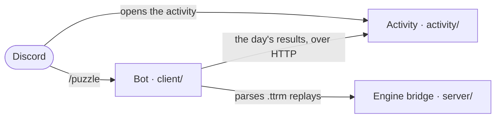

<div align="center">

# BaronChairStair

**A daily Tetris puzzle you play inside Discord.**

Four hand-made puzzles every day, a five-minute rush, 1v1 duels, and an archive
of 138 to work through — opened as a Discord Activity, announced by a bot that
tells the server who solved what.

`beta 0.7` · MIT licensed · Bun + TypeScript + Python

Built for the **Tetris at UCI** club.

</div>

---

## What you can do

| | |
| :-- | :-- |
| **Four puzzles a day** | An easy, a medium, a hard and an extreme, drawn from the club's archive. Every run is re-scored on the server by replaying the keys you actually pressed, so your screen and the leaderboard can never disagree. |
| **Puzzle rush** | Five minutes on the clock — solve as many as you can. |
| **1v1 duels** | The same puzzle and the same pieces, head to head. |
| **Explore the archive** | Every puzzle, any time. Solved ones are ticked off, and the maker's own walkthrough unlocks once you have cracked it yourself. |
| **Leaderboards and a profile** | Solve times, streaks, rush records, and every alternate line you were the first person to find. |
| **A puzzle builder** | Write your own, submit it, and an officer reviews it into the archive. |

These are **placement** problems, not reaction tests. Gravity is zero and
nothing locks until you hard-drop it, so a piece stays exactly where you put it
for as long as you leave it there — and undo and redo are always one key away.

---

## In Discord

| Command | What it does |
| :-- | :-- |
| `/puzzle` | Today's puzzles, and the link that opens the activity |
| `/highlights` | Attach a `.ttrm` replay — get each player's biggest attack bursts as boards |
| `/report` | File a bug or a suggestion. No GitHub account needed |
| `/activity graph`<br>`/activity now` | Who is online, right now or across the last week |
| `/internships …` | The club's internship tracker: recent postings, salaries, a ping list |
| `/archive sync` | **Officers only.** Pull the club's spreadsheet into the puzzle archive |

The day after each puzzle, the bot replies to its own announcement with how the
server did — who solved what, how fast, and how long the server's streak is.

Every command in detail: **[docs/bot.md](docs/bot.md)**.

---

## Quick start

### Play with the puzzles locally

```bash
cd activity
bun install
bun run build      # build the browser bundle — a restart is not a deploy
bun run dev        # http://localhost:3001
```

The puzzle data and the archive are **committed**, so a fresh clone can play
straight away — you do not need the club's spreadsheet for anything.

### Run the bot

```bash
cp example.env .env                                    # DISCORD_TOKEN at minimum
pip install discord.py python-dotenv aiohttp matplotlib
bun install                                            # repo root, for /highlights
cd client && python discord_bot.py
```

Everything except `/highlights` runs on Python alone. Enable the **Server
Members** and **Presence** intents in the Discord developer portal first, or
login fails outright rather than degrading.

---

## How the pieces fit



It began as a bridge that let Python drive the `@haelp/teto` engine to pull
highlights out of a replay. That bridge is still here and still does that job —
it is simply one part of four now:

| Part | Lives in | What it is |
| :-- | :-- | :-- |
| **The bot** | `client/` | Slash commands: the daily puzzle, replay highlights, activity graphs, an internship tracker |
| **The activity** | `activity/` | The game itself, served as a Discord Activity. [Its own README](activity/README.md) |
| **The engine bridge** | `server/` | A Bun process wrapping the TETR.IO engine, spoken to over NDJSON from Python |
| **The internship tracker** | `internship_poller.py` | Nothing to do with Tetris; it lives here because the bot fronts it |

The bot owns none of the game. It reads the activity's server and formats what
comes back, so the two cannot disagree about a score.

---

## Repo map

```
BaronChairStair/
├── activity/                the Discord Activity — own README, own tests, own .env
├── client/
│   ├── discord_bot.py       the bot: commands, schedulers, entry point
│   ├── puzzle_commands.py   /puzzle, and the daily recap
│   ├── archive_commands.py  /archive sync, behind an officer allowlist
│   ├── report_commands.py   /report — files a GitHub issue for a player
│   ├── teto_client.py       Python client for the engine bridge
│   └── render.py            attack-burst highlight boards
├── server/server.ts         Bun NDJSON stdio server — the engine side
├── docs/                    the bot in depth, and the bridge protocol
├── changelog.json           the version, and what each release changed
└── example.env              every environment variable, documented
```

---

## Where to read more

| Document | What is in it |
| :-- | :-- |
| [activity/README.md](activity/README.md) | The game in depth: scoring, rush, duels, the builder, the review queue |
| [docs/bot.md](docs/bot.md) | Every slash command, and why each is shaped the way it is |
| [docs/engine-bridge.md](docs/engine-bridge.md) | The NDJSON protocol between Python and the TETR.IO engine |
| [DEPLOY.md](DEPLOY.md) · [activity/DEPLOY.md](activity/DEPLOY.md) | Deploying each half. The order is load-bearing in both |
| [CLAUDE.md](CLAUDE.md) | The few rules that live nowhere else |
| [changelog.json](changelog.json) | Every release, newest first. The top entry is the version |

---

## Standalone tools

None of these are needed to run the bot.

```bash
python internship_poller.py sweep      # store and print what is new
python internship_poller.py watch      # every 15 minutes until Ctrl-C
python resolve_boards.py <careers-url> # careers page → a pollable job board
python sync_guilds.py SERVER_ID        # push slash commands into one guild, instantly
python check_dupes.py                  # find commands registered twice
```

Global slash commands take up to an hour to propagate; a guild copy is
immediate. Run `sync_guilds.py --clear SERVER_ID` once the global ones land, or
the picker shows every command twice.

---

## Prerequisites

| Tool | Version | Install |
| :-- | :-- | :-- |
| **Bun** | ≥ 1.2 | `curl -fsSL https://bun.sh/install \| bash` |
| **Python** | ≥ 3.10 | <https://python.org> |

`bun install` at the repo root pulls `@haelp/teto` for the engine bridge;
`activity/` has its own dependencies and its own `bun install`.

---

## Environment

Copy `example.env` to `.env` at the repo root — every variable is documented
inline. The ones that matter:

- **`DISCORD_TOKEN`** — the bot. Required.
- **`PUZZLE_APP_ID`, `PUZZLE_API`, `PUZZLE_API_KEY`** — the `/puzzle` command.
  `PUZZLE_API_KEY` must match `BOT_API_KEY` in `activity/.env` — different names
  on either side, and a mismatch is a silent 401.
- **`GEMINI_API_KEY`** — only for `internship_poller.py --llm`.

Who may run `/archive sync` is a file, not a variable: `puzzle-admins.json`,
gitignored, copied from `puzzle-admins.example.json`.

`.env` is gitignored and must stay that way.

---

## Contributing

`main` is protected and append-only. Branch off it, open a pull request, and get
one approving review from somebody other than the author — GitHub refuses a
self-approval, so even a solo change gets a second pair of eyes, and a new
commit dismisses the reviews the old one had.

Force pushes and branch deletion are refused for **every** account, owners
included. Nothing on `main` has been rewritten, because nothing on `main` can be.

Tests, before you open it:

```bash
cd activity && bun test && bun run typecheck   # the activity
python3 -m unittest discover -s client         # the bot
```

---

## Licence

[MIT](LICENSE) © 2026 tetrisatuci
